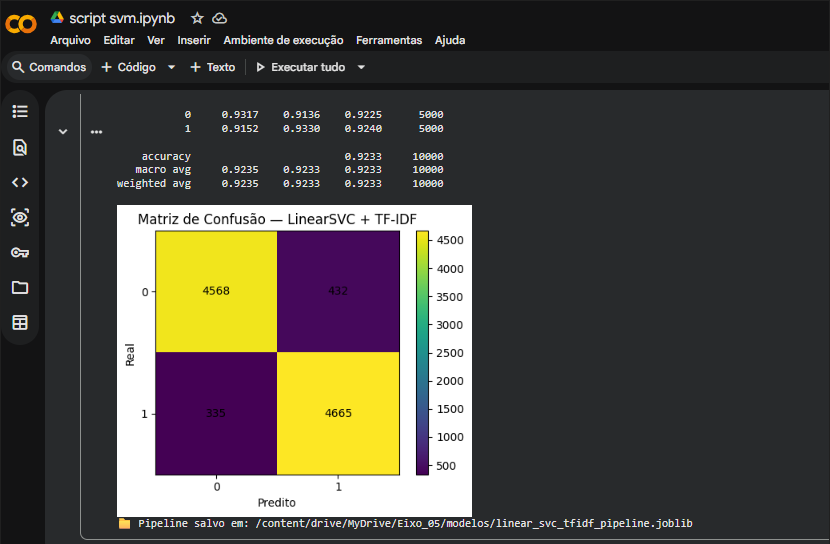

# imdb-sentiment-pipeline

Pipeline de classificação de sentimentos aplicado ao dataset Stanford IMDB, desenvolvido como parte da graduação em Tecnologia em Banco de Dados (PUC Minas, 2025/2).

O modelo de classificação foi desenvolvido individualmente — cada integrante do grupo criou e avaliou sua própria solução. Este repositório contém a minha implementação, que atingiu **92,33% de acurácia** com LinearSVC + TF-IDF.

---

## Resultado

| Métrica | Valor |
|---|---|
| Acurácia | 92,33% |
| F1-macro | 92,33% |
| Amostras de teste | 10.000 |
| Modelo | LinearSVC + TF-IDF |





---

## Arquitetura

```
Hugging Face (stanfordnlp/imdb)
        │
        ▼
Etapa 02 — Coleta e ingestão
coleta_dados.ipynb
→ carrega splits train/test
→ mapeia label numérico para "positive"/"negative"
→ renomeia coluna text → review
→ salva dataset.csv no Google Drive
        │
        ▼
Etapa 03 — Limpeza e processamento
processamento.ipynb → camadas Silver/Gold
        │
        ▼
Etapa 04 — Modelagem
script_svm.ipynb
→ lê dataset.csv (ou Parquet como fallback)
→ padroniza colunas automaticamente
→ treina TF-IDF + LinearSVC
→ avalia com accuracy, F1 e matriz de confusão
→ salva pipeline com joblib
```

---

## Stack

- Python 3
- Google Colab
- Pandas / NumPy
- scikit-learn (TfidfVectorizer, LinearSVC, Pipeline)
- Matplotlib
- Hugging Face Datasets
- joblib

---

## Como executar

> Os notebooks foram desenvolvidos para rodar no **Google Colab** com dados armazenados no **Google Drive**.

### Etapa 02 — Coleta
1. Abra `coleta_dados.ipynb` no Google Colab
2. Execute as células sequencialmente
3. O notebook baixa o dataset `stanfordnlp/imdb` via Hugging Face (25.000 amostras de treino + 25.000 de teste)
4. Mapeia os labels numéricos para `"positive"` e `"negative"`
5. Salva `dataset.csv` na pasta `/MyDrive/Eixo_05/dados/`

### Etapa 03 — Processamento
1. Abra `processamento.ipynb` no Google Colab
2. Carrega os arquivos gerados na etapa anterior
3. Realiza limpeza, tokenização e normalização textual
4. Exporta a base tratada nas camadas Silver/Gold

### Etapa 04 — Modelagem
1. Abra `script_svm.ipynb` no Google Colab
2. O script localiza automaticamente `dataset.csv` no Drive (com fallback para Parquet)
3. Padroniza os nomes das colunas automaticamente
4. Treina o pipeline TF-IDF + LinearSVC
5. Gera relatório de classificação e matriz de confusão
6. Salva o pipeline treinado em `/MyDrive/Eixo_05/modelos/linear_svc_tfidf_pipeline.joblib`

---

## Estrutura do repositório

```
imdb-sentiment-pipeline/
├── projeto/
│   └── Etapa_4/
│       └── script_svm.ipynb   # modelo LinearSVC — 92,33% de acurácia
├── coleta_dados.ipynb          # etapa 02 — ingestão e geração do CSV
├── processamento.ipynb         # etapa 03 — Silver/Gold
├── README.md
└── .gitignore
```

---

## Próximos passos

- Comparação entre modelos (Naive Bayes, Logistic Regression, BERT)
- Dashboard de resultados via Streamlit ou FastAPI

---

## Autora

**Andressa Cristina Chaves de Oliveira**  
Foco em Análise de Dados e Machine Learning  
[github.com/andressachaves](https://github.com/andressachaves)
